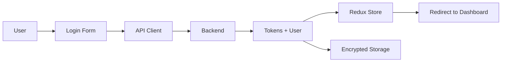

# ⚡ Quick Start Guide

## Get Running in 5 Minutes

### 1. Install Dependencies (Already Done ✅)

```bash
cd P:/LB2D/frontend-nextjs
npm install  # Already completed!
```

### 2. Environment Setup (Already Done ✅)

The `.env.local` file is already configured with defaults. You're ready to go!

### 3. Start Development Server

```bash
npm run dev
```

The application will start at **http://localhost:3000**

### 4. View the Landing Page

Open your browser and navigate to:
```
http://localhost:3000
```

You'll be redirected to the landing page automatically!

## 🎯 Available Routes

### Current (Working)
- `/` - Redirects to landing page
- `/landing` - Full-featured landing page with SEO

### To Be Created
- `/login` - Login page
- `/register` - Registration page
- `/dashboard` - User dashboard
- `/courses` - Course catalog
- `/about` - About page
- `/contact` - Contact page
- ... and more

## 🔧 Development Commands

```bash
# Start development server
npm run dev

# Build for production
npm run build

# Start production server
npm start

# Run linter
npm run lint

# Fix linting issues
npm run lint:fix

# Type check
npm run type-check

# Format code
npm run format

# Analyze bundle size
npm run analyze
```

## 📦 Project Structure Quick Reference

```
src/
├── app/                    # Pages (Next.js App Router)
│   ├── landing/           # ✅ Landing page (DONE)
│   ├── login/             # ⏳ Login page (TODO)
│   └── ...                # ⏳ Other pages (TODO)
│
├── components/            # Reusable components
│   ├── ui/               # ✅ UI primitives (DONE)
│   ├── layout/           # ✅ Layout components (DONE)
│   └── common/           # ✅ Common components (DONE)
│
├── features/             # Feature modules (domain-driven)
│   ├── auth/            # ⏳ Authentication (TODO)
│   ├── courses/         # ⏳ Courses (TODO)
│   └── ...              # ⏳ Other features (TODO)
│
├── lib/                  # Core libraries
│   ├── api/             # ✅ API client (DONE)
│   ├── auth/            # ✅ Auth utilities (DONE)
│   ├── seo/             # ✅ SEO utilities (DONE)
│   └── utils/           # ✅ Utilities (DONE)
│
├── store/               # ✅ Redux store (DONE)
├── types/               # ✅ TypeScript types (DONE)
└── config/              # ✅ Configuration (DONE)
```

## 🚀 Next Steps

### Step 1: Create Login Page

```typescript
// src/app/login/page.tsx
import { Metadata } from 'next';
import { generateMetadata } from '@/lib/seo/metadata';
import { Navbar } from '@/components/layout/Navbar';
import { Footer } from '@/components/layout/Footer';
// ... import your components

export const metadata: Metadata = generateMetadata({
  title: 'Login',
  description: 'Login to your LB2D account',
});

export default function LoginPage() {
  return (
    <>
      <Navbar />
      <main className="container-custom py-20">
        {/* Your login form here */}
      </main>
      <Footer />
    </>
  );
}
```

### Step 2: Create Authentication API

```typescript
// src/features/auth/api/index.ts
import { apiClient } from '@/lib/api/client';
import { LoginCredentials, User } from '@/types';
import { getDeviceInfo } from '@/lib/auth/token';

export const authApi = {
  login: async (credentials: LoginCredentials) => {
    return apiClient.post<{
      user: User;
      accessToken: string;
      refreshToken: string;
    }>('/auth/login', {
      ...credentials,
      deviceInfo: getDeviceInfo(),
    });
  },

  register: async (data: RegisterData) => {
    return apiClient.post<{ user: User }>('/auth/register', data);
  },

  logout: async () => {
    return apiClient.post('/auth/logout');
  },
};
```

### Step 3: Create Authentication Hook

```typescript
// src/features/auth/hooks/useAuth.ts
'use client';

import { useState } from 'react';
import { useDispatch } from 'react-redux';
import { useRouter } from 'next/navigation';
import { setCredentials } from '@/store/slices/authSlice';
import { authApi } from '../api';
import toast from 'react-hot-toast';

export function useAuth() {
  const [isLoading, setIsLoading] = useState(false);
  const dispatch = useDispatch();
  const router = useRouter();

  const login = async (credentials: LoginCredentials) => {
    try {
      setIsLoading(true);
      const response = await authApi.login(credentials);

      const { user, accessToken, refreshToken } = response.data;

      dispatch(setCredentials({ user, accessToken, refreshToken }));

      toast.success(`Welcome back, ${user.name}!`);

      // Redirect based on role
      if (user.role === 'admin') {
        router.push('/admin/dashboard');
      } else if (user.role === 'supervisor') {
        router.push('/supervisor/dashboard');
      } else {
        router.push('/dashboard');
      }
    } catch (error: any) {
      toast.error(error.message || 'Login failed');
      throw error;
    } finally {
      setIsLoading(false);
    }
  };

  return { login, isLoading };
}
```

## 🎨 UI Component Usage Examples

### Button
```tsx
import { Button } from '@/components/ui/button';

<Button variant="default">Primary</Button>
<Button variant="secondary">Secondary</Button>
<Button variant="outline">Outline</Button>
<Button variant="ghost">Ghost</Button>
<Button variant="destructive">Delete</Button>
<Button isLoading>Loading...</Button>
```

### Input
```tsx
import { Input } from '@/components/ui/input';
import { Label } from '@/components/ui/label';

<div>
  <Label htmlFor="email">Email</Label>
  <Input
    id="email"
    type="email"
    placeholder="your@email.com"
    error={errors.email?.message}
  />
</div>
```

### Card
```tsx
import { Card, CardHeader, CardTitle, CardDescription, CardContent } from '@/components/ui/card';

<Card>
  <CardHeader>
    <CardTitle>Title</CardTitle>
    <CardDescription>Description</CardDescription>
  </CardHeader>
  <CardContent>
    Content here
  </CardContent>
</Card>
```

## 🔐 Authentication Flow



## 📊 State Management

```typescript
// Access auth state
import { useSelector } from 'react-redux';
import { selectCurrentUser, selectIsAuthenticated } from '@/store/slices/authSlice';

function MyComponent() {
  const user = useSelector(selectCurrentUser);
  const isAuthenticated = useSelector(selectIsAuthenticated);

  return (
    <div>
      {isAuthenticated ? (
        <p>Welcome, {user?.name}!</p>
      ) : (
        <p>Please login</p>
      )}
    </div>
  );
}
```

## 🎯 Creating a New Page Checklist

- [ ] Create page directory: `src/app/page-name/`
- [ ] Create `page.tsx` with metadata
- [ ] Add SEO optimization
- [ ] Include JSON-LD if relevant
- [ ] Add to navigation if needed
- [ ] Create feature API if needed
- [ ] Create custom hooks if needed
- [ ] Test responsiveness
- [ ] Test accessibility
- [ ] Test SEO (Lighthouse)

## 🐛 Troubleshooting

### Port Already in Use
```bash
# Kill process on port 3000
npx kill-port 3000
```

### Module Not Found
```bash
# Reinstall dependencies
rm -rf node_modules package-lock.json
npm install
```

### Type Errors
```bash
# Run type check
npm run type-check
```

### Styling Not Working
```bash
# Rebuild Tailwind
npm run dev
# Clear Next.js cache
rm -rf .next
```

## 📚 Additional Resources

- **README.md** - Full documentation
- **MIGRATION_STATUS.md** - Detailed progress report
- **Next.js Docs** - https://nextjs.org/docs
- **Tailwind Docs** - https://tailwindcss.com/docs
- **TypeScript Docs** - https://www.typescriptlang.org/docs

## 💡 Pro Tips

1. **Use the Examples** - The Landing page is a complete example. Copy its structure!

2. **Reuse Components** - Don't recreate. Use existing UI components.

3. **Follow the Patterns** - API → Hook → Component → Page

4. **Type Everything** - Let TypeScript catch errors early.

5. **Test Frequently** - Check your work in the browser often.

6. **Use Hot Toast** - Already configured for notifications!
   ```tsx
   import toast from 'react-hot-toast';
   toast.success('Success!');
   toast.error('Error!');
   ```

7. **Use Loading States** - Button has `isLoading` prop built-in.

8. **Check Mobile** - Always test responsive design.

---

## 🎉 You're Ready!

Your foundation is **enterprise-grade**. Now build out the remaining pages following the established patterns. Good luck! 🚀
